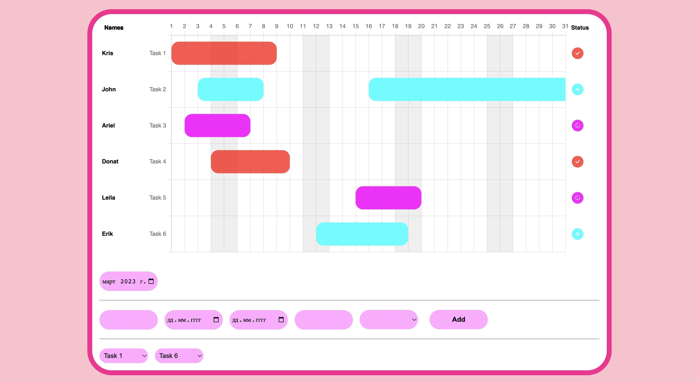

# Gantt-Chart
### Creating simple Gantt Chart with Chart JS
 With the help of Gant Chart we can add new tasks, filter them, allocate them by months and dates. You can also add tasks for specific users that have already been created in our list.
